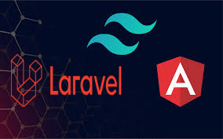
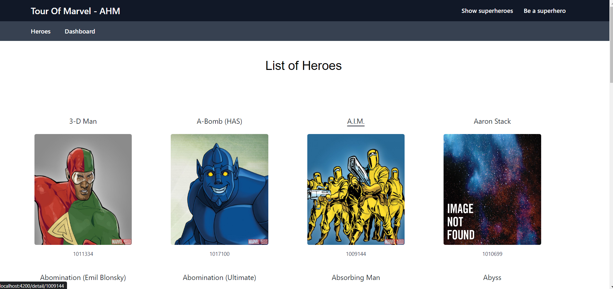
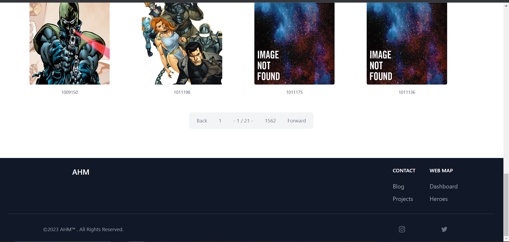
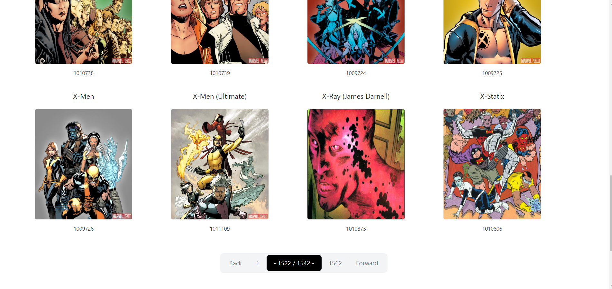
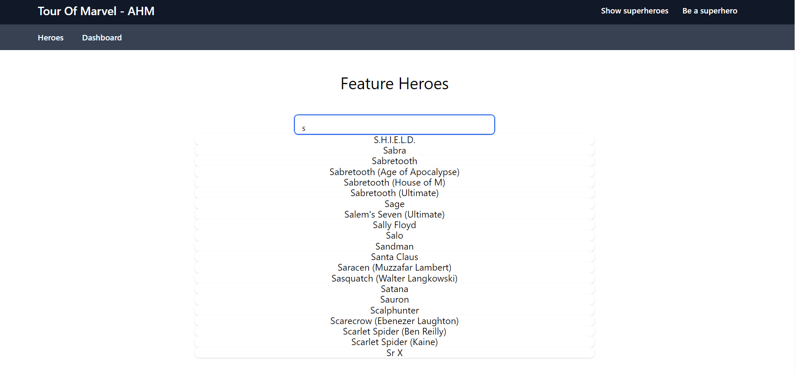
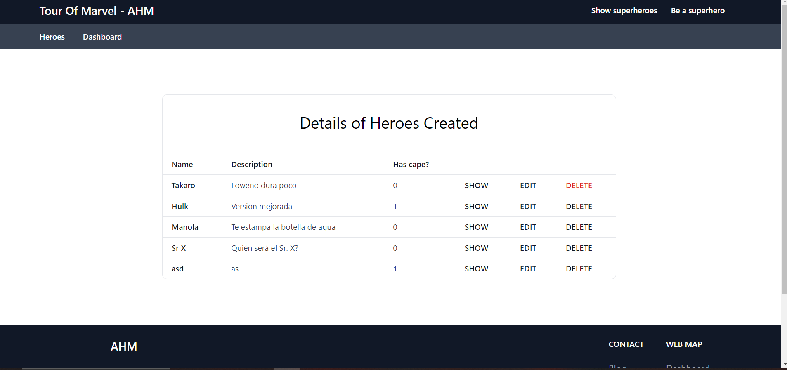
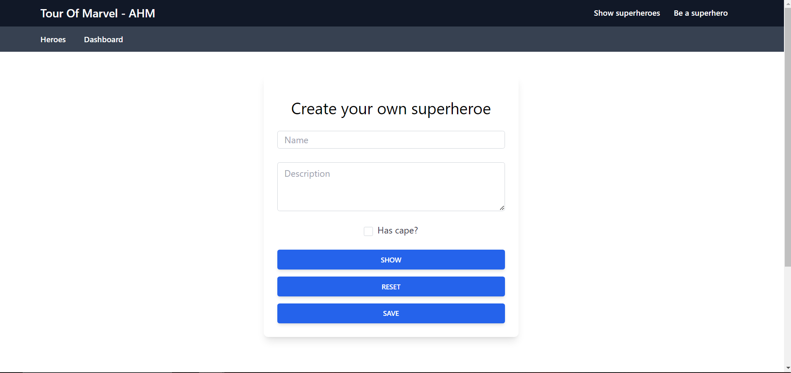

# Tour of heroes 22-23

  

>Proyecto
>> Tecnologías
>>> Este proyecto web ha sido creado con las siguientes técnologías: Lavarel, Angular, Tailwind y MySql. Todas las llamadas a la API se realizan desde servicios a través de observables. 
>
>> Introducción
>>> Se ha llevado a cabo uniendo la API de Marvel y creando ciertas páginas donde cada una tiene funciones y especificaciones diferentes.
>
>> Adicional
>>> Habían ciertas cosas que eran obligatorias pero también se nos dejaba añadir funcionalidades extra. En mi caso, he creado un pequeño CRUD añadiendo una nueva tabla en una DB para que puedas crearte tu propio héroe. También he aprovechado el buscador donde se muestra la lista de héroes para que al hacer la búsqueda, aparezcan en la misma lista tantos los hérores de Marvel como lo hérores creados de mi DB.
>
>> Diseño
>>> Como se puede ver, el diseño de esta página web es bastante minimalista y simple. Decidí no dedicarle más tiempo debido a que tenía varias funcionalidades extra que quería añadir y tenía que elegir entre una cosa u otra.

>BackEnd
>>Todo la parte del BackEnd está subida en el repositio GestionApp. Es uno de los repositios donde hacía algunas pruebas o trabajos, por lo que hay muchas más tablas en la DB.

>Mapa Web
>> Dashboard
>>> Es una lista de 20 superheroes aleatorios donde se muestra el nombre y la foto. También tiene una barra de búsqueda donde puedes buscar por nombre (también se muestran los superheroes creados en el CRUD).
>
>>Heroes
>>> Es un listado de todos los superherores obtenidos de la API de Marvel. Están paginados de 20 en 20 (desde el lado del servidor), tiene botones para desplazarse y otro para mostrar los últimos de la lista.
>
>>Show Superheroes
>>> Muestra una tabla donde está reflejada la información de los heroes que hemos creado. Puedes ver la información o borrar al héroe (la función de editar no llegué a hacerla ya que es un añadido extra y tenía poco tiempo).
>
>>Be a Superhero
>>> Es un pequeño formulario para crearte tu propio superheroe y poder aparecer en la lista junto a otros como Spiderman, Hulk... Tiene 3 campos: nombre, apellidos y si tiene capa o no. También tiene 3 botones: uno para ver los datos antes de añadirlos a la lista, otro para resetear el formulario y el de guardar datos.

  
  
  
  
  
  

